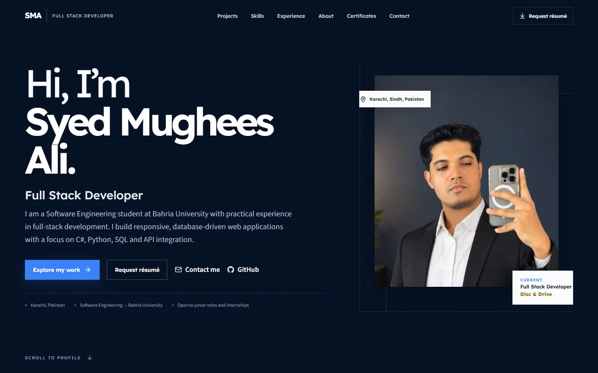

# Syed Mughees Ali — Developer Portfolio

A recruiter-focused personal portfolio presenting my software-development experience, selected projects, technical capabilities, education, and professional certificates.

**Live portfolio:** [syedmugheesali.vercel.app](https://syedmugheesali.vercel.app)

## About the portfolio

The site is designed to make professional information and project evidence easy to review. It uses a responsive technical-editorial layout, concise verified content, and accessible interactions across mobile, tablet, and desktop devices.

## Highlights

- Responsive recruiter-focused project showcase
- Professional experience and education sections
- Continuously moving, manually controlled certificate carousel
- Keyboard navigation, visible focus states, and reduced-motion support
- Search-friendly metadata and structured data
- Optimized portrait, project screenshots, and certificate imagery

## Featured projects

- [Developer Portfolio](https://github.com/syedmugheessali/Personal-portfolio)
- [Ledgerly Expense Tracker](https://github.com/syedmugheessali/expense-tracker-js)
- [EventEase](https://github.com/syedmugheessali/EventEase)

## Built with

Next.js, React, TypeScript, responsive CSS, Motion, GSAP, and Playwright.

## Connect

- [GitHub](https://github.com/syedmugheessali)
- [LinkedIn](https://www.linkedin.com/in/syedmugheesali/)
