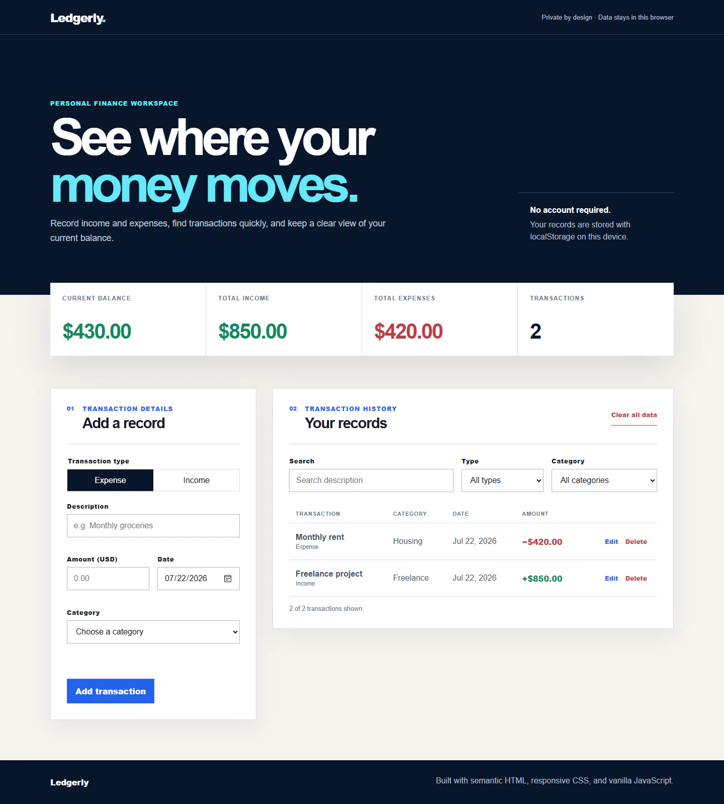

# Ledgerly — Vanilla JavaScript Expense Tracker

Ledgerly is a responsive, browser-based income and expense tracker. It demonstrates practical JavaScript fundamentals without a framework: DOM updates, event handling, arrays and objects, validation, filtering, calculated summaries, and persistent local state.



## Features

- Add, edit, and delete income or expense transactions.
- Capture a description, positive amount, category, and date with inline validation.
- Search descriptions and filter records by type or category.
- Calculate total income, total expenses, current balance, and record count.
- Save and restore transactions with `localStorage`, including storage error feedback.
- Confirm before clearing all data.
- Show useful first-use and no-results empty states.
- Support keyboard navigation, visible focus states, reduced motion, and touch-friendly controls.
- Adapt the form, summary, and table from mobile through desktop layouts.

## Run locally

The app has no runtime dependencies. Serve this folder with any static web server so ES modules load correctly. For example, from the repository root:

```powershell
npx serve .
```

Open the local URL printed by the server.

## Tests

The calculation, validation, and filtering helpers use Node's built-in test runner:

```powershell
npm test
```

## Project structure

```text
expense-tracker-js/
├── css/styles.css
├── docs/expense-tracker-dashboard.webp
├── js/app.js
├── js/transaction-utils.js
├── tests/transaction-utils.test.js
├── index.html
└── package.json
```

## Deployment

This is a static site and can be deployed to GitHub Pages, Netlify, or Vercel without a build command. Select this folder as the deployment root and publish `index.html`. No environment variables are required.

No public deployment URL is listed until the project has actually been deployed.
